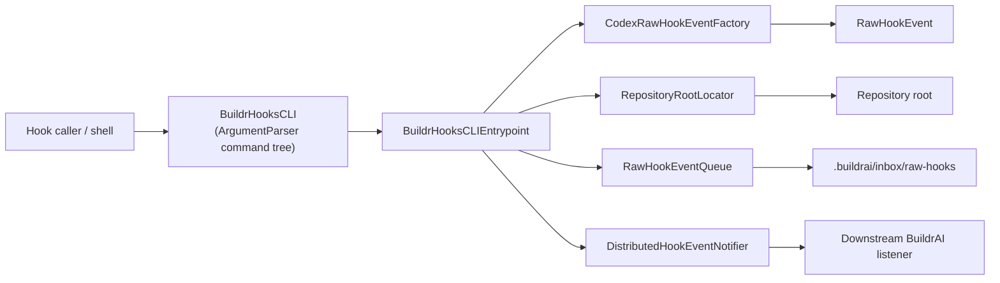
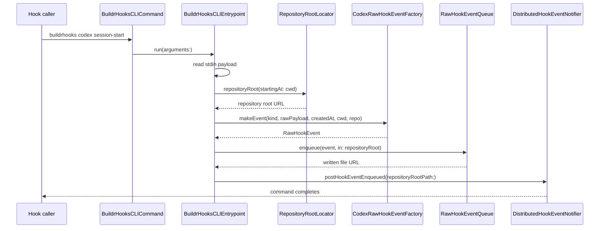
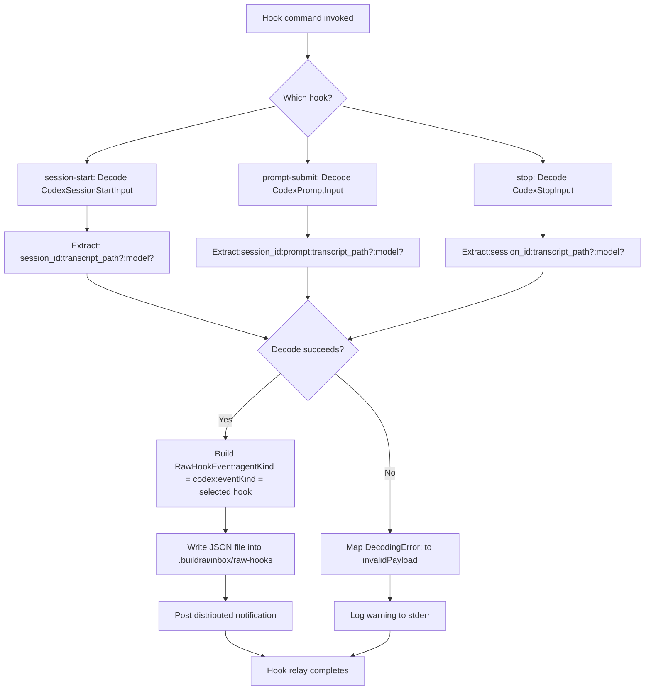
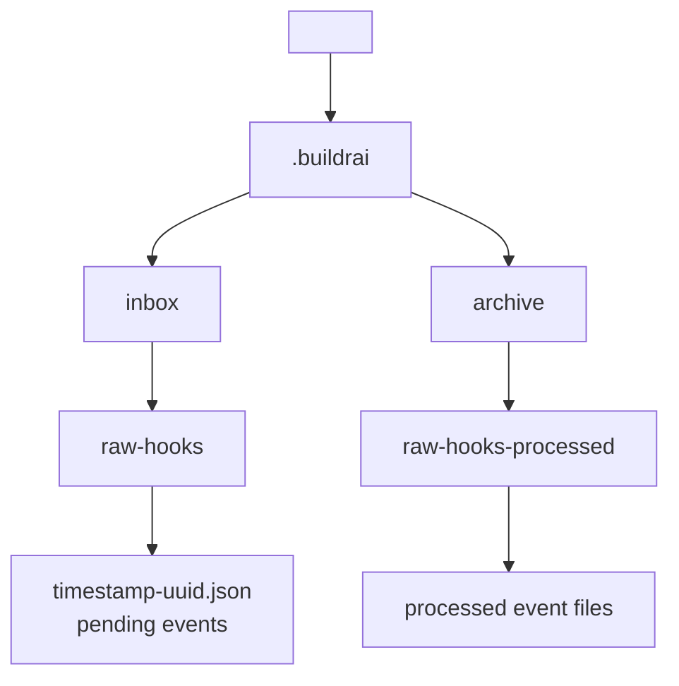

# BuildrHooksCLI Architecture

This package is a small relay that turns hook invocations from Codex into durable JSON files under a repository-local queue. Its job is intentionally narrow:

1. Accept a CLI command such as `buildrhooks codex session-start`.
2. Read the hook payload from standard input.
3. Convert that payload into a normalized `RawHookEvent`.
4. Write the event into `.buildrai/inbox/raw-hooks` under the current repository.
5. Broadcast a distributed macOS notification so another process can react.

## Module Layout

- `BuildrHooksCLI`
  Thin executable target built on `swift-argument-parser`. It defines the user-facing command tree and forwards execution into the core library.
- `BuildrHooksCore`
  Contains the actual runtime behavior: argument validation, payload parsing, repository discovery, queue persistence, and notifications.

## End-to-End Flow

### 1. Command dispatch

The executable entrypoint lives in `Sources/BuildrHooksCLI/BuildrHooksCLICommand.swift`.

- `BuildrHooksCLICommand` defines the root command, `buildrhooks`.
- `CodexCommand` defines the `codex` namespace.
- Each hook event is modeled as its own subcommand:
  - `session-start`
  - `prompt-submit`
  - `stop`

All three subcommands conform to the private `HookEventExecutable` protocol. Its default `run()` implementation translates the parsed command back into a normalized `[String]` argument list and hands control to `BuildrHooksCLIEntrypoint`.

This keeps `ArgumentParser` concerns at the edge and leaves the actual logic in testable library code.

### 2. Runtime orchestration

`Sources/BuildrHooksCore/BuildrHooksCLIEntrypoint.swift` is the orchestration layer.

It injects a few environment-dependent behaviors:

- `standardInputProvider`
- `standardErrorWriter`
- `currentWorkingDirectoryProvider`
- `now`
- `repositoryRootLocator`
- `queue`
- `notifier`

That design lets tests drive the CLI behavior without shelling out or depending on global process state.

At runtime, `run(arguments:)` does the following:

1. Drops the executable name and validates that exactly two components remain: `<agent> <event>`.
2. Validates the agent. Right now the only supported agent is `codex`.
3. Validates the event string by converting it into `HookEventKind`.
4. Reads the raw stdin payload.
5. Resolves the repository root from the current working directory.
6. Asks `CodexRawHookEventFactory` to parse and normalize the payload.
7. Enqueues the resulting `RawHookEvent` as JSON on disk.
8. Posts a notification containing the repository root path.

Unsupported command shapes, agents, and event names throw `BuildrHooksCLIError` immediately.

Parse and persistence failures are handled differently: they are caught, logged to stderr as warnings, and do not escape the command. This makes hook ingestion best-effort rather than fatal to the caller.

## Payload Normalization

`Sources/BuildrHooksCore/Codex/CodexRawHookEventFactory.swift` converts agent-specific payloads into the shared event model.

### Why a factory exists

Hook payloads are agent-specific and may have different field requirements for each event kind. The factory isolates that knowledge so the rest of the system only deals with a single normalized type: `RawHookEvent`.

### Supported Codex payloads

The factory currently knows how to decode three input shapes:

- `session-start`
- `prompt-submit`
- `stop`

Each shape has its own private `Codable` input struct. The public `makeEvent(...)` method:

1. Preserves the original UTF-8 payload string for auditing via `rawPayload`.
2. Parses the structured fields needed by BuildrAI.
3. Returns a `RawHookEvent` with:
   - `agentKind = .codex`
   - the hook `eventKind`
   - timestamps and path context supplied by the caller
   - normalized `sessionID`, `transcriptPath`, and `model`

### Error mapping

If JSON decoding fails, the factory maps `DecodingError` cases into `CodexHookRelayError.invalidPayload`.

This intentionally hides low-level decoding details and gives the caller one stable semantic error: the payload was invalid for the expected hook kind.

## Canonical Event Model

`Sources/BuildrHooksCore/RawHookEvent.swift` defines the persisted event schema.

Important fields:

- `payloadVersion`
  Version marker for future schema evolution. It currently defaults to `1`.
- `agentKind`
  The source agent, currently only `codex`.
- `eventKind`
  The hook lifecycle event.
- `createdAt`
  Timestamp chosen by the entrypoint, not by the payload.
- `currentWorkingDirectory`
  The working directory where the hook was invoked.
- `repositoryRootPath`
  The repository root chosen by `RepositoryRootLocator`.
- `sessionID`, `transcriptPath`, `model`
  Structured fields extracted from the agent payload.
- `rawPayload`
  The original payload string exactly as received, when valid UTF-8.

The queue writes this type as pretty-printed, sorted JSON with ISO 8601 dates.

## Repository Root Resolution

`Sources/BuildrHooksCore/RepositoryRootLocator.swift` determines where queue files should be written.

It walks upward from the current working directory until it finds a `.git` marker.

- If a `.git` entry is found in an ancestor, that ancestor becomes the repository root.
- If no `.git` marker is found before reaching filesystem root, the original working directory is used instead.

This allows hooks fired from nested directories inside a repository to converge on one shared queue location.

## Queue Persistence

`Sources/BuildrHooksCore/RawHookEventQueue.swift` is responsible for durable on-disk storage.

### Directory layout

For a repository root at `<repo>`, the queue uses:

- `<repo>/.buildrai/inbox/raw-hooks`
- `<repo>/.buildrai/archive/raw-hooks-processed`

The enqueue step ensures both directories exist before writing anything. The processed archive directory is created up front because downstream consumers are expected to move handled files there.

### File naming

Each file name is:

- UTC timestamp in `yyyyMMdd'T'HHmmssSSS'Z'` format
- followed by a lowercase UUID
- ending in `.json`

That gives deterministic chronological ordering plus uniqueness.

### Write behavior

The queue encodes the `RawHookEvent` and writes it atomically to the raw-hooks inbox. Atomic writes reduce the chance of consumers seeing a partially written file.

## Notification Handoff

`Sources/BuildrHooksCore/HookEventNotifier.swift` defines the final handoff after enqueue succeeds.

- `HookEventNotifying` is the abstraction.
- `DistributedHookEventNotifier` is the macOS implementation.

It posts a distributed notification named `ai.buildrai.hook-event-enqueued` with the repository root path in `userInfo`.

The CLI itself does not process queued events. It only persists them and signals that new work is available.

## Error Handling Strategy

There are two distinct error classes in the design:

### Usage errors

`BuildrHooksCLIError` covers invalid command shape, unsupported agents, and unsupported event names.

These are treated as programmer or caller errors and are thrown directly.

### Ingestion errors

Payload parsing errors and queue write failures happen after the command has already been recognized as valid.

These are caught inside `BuildrHooksCLIEntrypoint.run(arguments:)`, reported to stderr as warnings, and suppressed so the hook caller does not fail hard.

That tradeoff suggests the CLI is meant to be resilient inside a larger automation chain where dropping one hook is preferable to interrupting the user flow.

## Testability Notes

Most of the important behavior lives in `BuildrHooksCore` rather than the executable target. That enables focused unit tests for:

- entrypoint orchestration
- payload parsing and normalization
- queue file creation
- repository root discovery
- CLI error formatting

The injected closures and protocol-based notifier are what make those tests straightforward.

## Current Constraints

- Only the `codex` agent is supported.
- Only three hook events are supported: `session-start`, `prompt-submit`, and `stop`.
- Queue persistence is local filesystem based.
- Notification delivery is macOS-specific through `DistributedNotificationCenter`.

If the CLI grows to support more agents, the cleanest extension point is likely:

1. add a new agent case to `HookAgentKind`
2. add a new raw payload factory for that agent
3. route the agent in `BuildrHooksCLIEntrypoint`
4. expose the matching subcommands in `BuildrHooksCLICommand`
